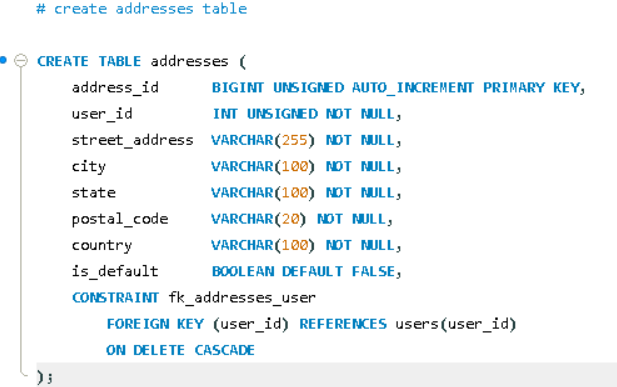

English Explanation


```sql
CREATE TABLE addresses (

```

A new table named **`addresses`** is being created to store the shipping/billing addresses of users. A single user can have multiple addresses (establishing a One-to-Many relationship with the `users` table).

---

```sql
address_id BIGINT UNSIGNED AUTO_INCREMENT PRIMARY KEY,

```

* **`address_id`** — The unique identity of this table, distinguishing each address row.
* **`BIGINT UNSIGNED`** — A large, positive-only integer.
* **`AUTO_INCREMENT`** — The value increases automatically with every new address inserted (1, 2, 3...).
* **`PRIMARY KEY`** — The main unique identifier for this table; it can never be NULL or duplicated.

---

```sql
user_id BIGINT UNSIGNED NOT NULL,

```

* This is a **Foreign Key column** — meaning it indicates which user this address belongs to.
* **`NOT NULL`** — Every address must be linked to a user; an address cannot exist without a user.
* *Note:* It is not a `PRIMARY KEY` here because a user can have multiple addresses (hence, `user_id` can repeat in this table — a 1-to-many relationship).

---

```sql
street_address  VARCHAR(255) NOT NULL,
city            VARCHAR(100) NOT NULL,
state           VARCHAR(100) NOT NULL,
postal_code     VARCHAR(20) NOT NULL,
country         VARCHAR(100) NOT NULL,

```

* Standard components of an address — all are **`NOT NULL`**, meaning a row cannot be inserted without a complete address (leaving any address field blank is not allowed).
* **`postal_code VARCHAR(20)`** — Kept as text instead of a number type because postal codes in some countries contain letters (e.g., UK: "SW1A 1AA"), and a text data type is necessary to preserve leading zeros.

---

```sql
is_default BOOLEAN DEFAULT FALSE,

```

* **`BOOLEAN`** — Stores a TRUE/FALSE value (internally in MySQL, this is represented as `TINYINT(1)`: 1 = TRUE, 0 = FALSE).
* This indicates which address is the user's **default/primary address** (which should be selected by default during checkout) if they have multiple addresses.
* **`DEFAULT FALSE`** — If no value is provided during insertion, it automatically sets to FALSE. Meaning, a newly added address will be "non-default" by default unless explicitly set to TRUE.

---

```sql
CONSTRAINT fk_addresses_user
    FOREIGN KEY (user_id) REFERENCES users(user_id)
    ON DELETE CASCADE,

```

This is the most critical part — it **defines the relationship between the `addresses` and `users` tables**:

* **`CONSTRAINT fk_addresses_user`** — A name is given to this foreign key rule (`fk_addresses_user`), making it easier to identify and manage the constraint later.
* **`FOREIGN KEY (user_id) REFERENCES users(user_id)`** — This states: the `user_id` column in this table points to the `user_id` (which is the primary key) in the `users` table. This means only values that already exist in the `users` table can be inserted here — no random/invalid `user_id` can be added (maintaining strict data integrity).
* **`ON DELETE CASCADE`** — This is a vital rule: **if a user is deleted from the `users` table, all of their linked addresses will be automatically deleted as well**. This prevents the creation of "orphan records" (addresses that belong to a non-existent user) and keeps the database clean.

---

**Summary in one line:**
The `addresses` table stores one or more addresses for each user, is linked to the `users` table via the `user_id` foreign key, ensures through `ON DELETE CASCADE` that deleting a user also automatically deletes their addresses, and uses the `is_default` flag to identify the user's primary address.

**Understanding the Foreign Key concept overall:**
This is a method of binding two tables in a "relationship" — the `users` table acts as the "parent", and the `addresses` table acts as the "child". The child table must always contain a valid reference to a parent record (a concept known as referential integrity).

```

```


Hinglish Explanation


```sql
CREATE TABLE addresses (
```
Ek naya table banaya jaa raha hai jiska naam **`addresses`** hai — isme users ke shipping/billing addresses store honge. Ek user ke multiple addresses ho sakte hain (One-to-Many relationship `users` ke saath).

---

```sql
address_id BIGINT UNSIGNED AUTO_INCREMENT PRIMARY KEY,
```
- **`address_id`** — is table ki apni unique identity, har address row ko alag pehchanta hai.
- **`BIGINT UNSIGNED`** — bada, positive-only integer.
- **`AUTO_INCREMENT`** — har naye address ke saath value khud-ba-khud badhti hai (1, 2, 3...).
- **`PRIMARY KEY`** — is table ka main unique key, kabhi NULL ya duplicate nahi ho sakta.

---

```sql
user_id BIGINT UNSIGNED NOT NULL,
```
- Yeh **Foreign Key column** hai — yani yeh batata hai ki yeh address kis user ka hai.
- **`NOT NULL`** — har address kisi na kisi user se linked hona hi chahiye, bina user ke koi address nahi ho sakta.
- Note: yahan `PRIMARY KEY` nahi hai kyunki ek user ke multiple addresses ho sakte hain (isliye `user_id` repeat ho sakta hai is table me — 1-to-many relationship).

---

```sql
street_address  VARCHAR(255) NOT NULL,
city            VARCHAR(100) NOT NULL,
state           VARCHAR(100) NOT NULL,
postal_code     VARCHAR(20) NOT NULL,
country         VARCHAR(100) NOT NULL,
```
- Address ke standard components — sab **`NOT NULL`** hain, yani ek complete address ke bina row insert nahi ho sakti (address ka koi field khali chhodna allow nahi).
- **`postal_code VARCHAR(20)`** — number type ke bajaye text isliye kyunki kuch countries ke postal codes me letters bhi hote hain (jaise UK: "SW1A 1AA"), aur leading zero preserve karne ke liye bhi text better hai.

---

```sql
is_default BOOLEAN DEFAULT FALSE,
```
- **`BOOLEAN`** — TRUE/FALSE value store karta hai (MySQL me internally yeh `TINYINT(1)` hota hai: 1 = TRUE, 0 = FALSE).
- Yeh batata hai ki agar user ke multiple addresses hain, to kaunsa unka **default/primary address** hai (jo checkout ke time by-default select ho).
- **`DEFAULT FALSE`** — agar insert karte time value nahi di, to automatically FALSE set ho jaayega, matlab naya address by-default "non-default" hoga jab tak explicitly TRUE na set karein.

---

```sql
CONSTRAINT fk_addresses_user
    FOREIGN KEY (user_id) REFERENCES users(user_id)
    ON DELETE CASCADE,
```
Yeh sabse important part hai — **relationship define karta hai `addresses` aur `users` table ke beech**:

- **`CONSTRAINT fk_addresses_user`** — is foreign key rule ko ek naam diya gaya hai (`fk_addresses_user`), taaki baad me identify/manage karna aasan ho.
- **`FOREIGN KEY (user_id) REFERENCES users(user_id)`** — yeh bolta hai: is table ka `user_id` column, `users` table ke `user_id` (jo primary key hai) ko point karta hai. Matlab is column me sirf wahi values aa sakti hain jo `users` table me already exist karti hain — koi random/invalid `user_id` insert nahi ho sakta (data integrity maintain hoti hai).
- **`ON DELETE CASCADE`** — yeh sabse zaroori rule hai: **agar `users` table se koi user delete kiya jaaye, to uska sab addresses automatically delete ho jaayenge**. Isse "orphan records" (aise addresses jinka koi user hi nahi hai) create nahi hote, database clean rehta hai.

---

**Summary ek line me:** `addresses` table har user ke ek ya zyada addresses store karta hai, `user_id` foreign key ke through `users` table se juda hota hai, `ON DELETE CASCADE` ensure karta hai ki user delete hone par uske addresses bhi automatically delete ho jaayein, aur `is_default` flag batata hai ki kaunsa address user ka primary address hai.

**Foreign Key concept overall samajhne ke liye:** Yeh do tables ko "relationship" me bandhne ka tarika hai — `users` table "parent" hai, `addresses` table "child" hai. Child table me hamesha ek valid parent record hona chahiye (referential integrity).

