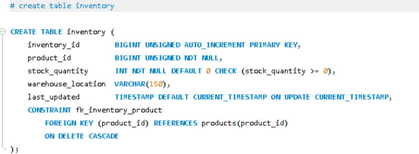

English Explanation


```markdown
Let's understand the `inventory` table:

```sql
CREATE TABLE inventory (

```

A new table named **`inventory`** is being created — this tracks how much stock each product has and where (in which warehouse) it is stored.

---

```sql
inventory_id BIGINT UNSIGNED AUTO_INCREMENT PRIMARY KEY,

```

* **`inventory_id`** — The unique, auto-generated ID for each inventory record.
* **`PRIMARY KEY`** — The main unique identifier for this table.

---

```sql
product_id BIGINT UNSIGNED NOT NULL,

```

* This is a **Foreign Key column** indicating which product this stock entry belongs to.
* **`NOT NULL`** — Every inventory record must be linked to a product; a stock entry without a product makes no sense.
* *Note:* `product_id` is not made the `PRIMARY KEY` here. Instead, a separate `inventory_id` is used so that the stock of a single product can be tracked across multiple warehouse locations (e.g., if a product is in both the Jaipur warehouse and the Delhi warehouse, there will be two separate rows). This establishes a One-to-Many relationship with products, as mentioned in the README.

---

```sql
stock_quantity INT NOT NULL DEFAULT 0 CHECK (stock_quantity >= 0),

```

Three important things are happening here at once:

* **`INT`** — A whole number, because stock quantity cannot have decimals (you can't sell 5.5 units).
* **`NOT NULL DEFAULT 0`** — If no value is provided, it automatically sets to 0 (meaning a new product starts with zero stock, not a negative or missing value).
* **`CHECK (stock_quantity >= 0)`** — Just like with `products.price`, this is a database-level validation ensuring stock can never be negative. This solves a real business problem: if there's a bug in the application code that mistakenly tries to reduce the stock to -5, the database itself will outright reject this invalid operation.

---

```sql
warehouse_location VARCHAR(150),

```

* Stores the name or location of the warehouse as text (e.g., "Jaipur Warehouse A").
* Since `NOT NULL` is absent, this is an **optional field** — a record can still be inserted even if the exact warehouse information is temporarily unknown.

---

```sql
last_updated TIMESTAMP DEFAULT CURRENT_TIMESTAMP ON UPDATE CURRENT_TIMESTAMP,

```

This is the most interesting line, with a completely different behavior compared to the `created_at` in previous tables:

* **`DEFAULT CURRENT_TIMESTAMP`** — When the row is inserted for the first time, it records the current time (as seen before).
* **`ON UPDATE CURRENT_TIMESTAMP`** — This is new: whenever this row is **UPDATED** (e.g., stock quantity changes when an order is placed and stock decreases), this column will automatically refresh to the current time, without you having to update it manually.
* This is crucial because inventory is constantly being updated (stock comes and goes), and you always need to know "when the stock was last updated." When combined with a database trigger (like the `trg_reduce_stock` we created in `Queries.sql`), it keeps track of this entirely automatically.

### 💡 Key Difference: Timestamp Behaviors

| Column | When does it update? |
| --- | --- |
| **`created_at`** *(in products/orders)* | Only once, when the row is initially inserted. |
| **`last_updated`** *(in inventory)* | At the time of insertion, **AND** every single time a change is made to the row. |

---

```sql
CONSTRAINT fk_inventory_product
    FOREIGN KEY (product_id) REFERENCES products(product_id)
    ON DELETE CASCADE,

```

* **`FOREIGN KEY (product_id) REFERENCES products(product_id)`** — The `inventory.product_id` can only accept values that already exist in the `products` table.
* **`ON DELETE CASCADE`** — If a product is deleted from the `products` table, all of its corresponding inventory records will also be automatically deleted. This is completely logical: if the product no longer exists, there is no point in tracking its stock (this is the same CASCADE behavior seen in the `addresses` table).


---

**Summary in one line:**
The `inventory` table tracks the stock quantity and warehouse location for each product, allowing multiple warehouse entries per product, uses a `CHECK` constraint to prevent negative stock, and leverages `ON UPDATE CURRENT_TIMESTAMP` to automatically track exactly when the stock was last changed — making it a highly useful feature for real-time inventory management.

```

```

Hinglish Explanation

Chaliye is `inventory` table ko samjhte hain:

```sql
CREATE TABLE inventory (
```
Naya table **`inventory`** — yeh track karta hai ki har product ka stock kitna hai aur kahan (kis warehouse me) rakha hai.

---

```sql
inventory_id BIGINT UNSIGNED AUTO_INCREMENT PRIMARY KEY,
```
- Har inventory record ka apna unique, auto-generated ID.
- **`PRIMARY KEY`** — is table ka main identifier.

---

```sql
product_id BIGINT UNSIGNED NOT NULL,
```
- **Foreign Key column** — batata hai ki yeh stock entry kis product ki hai.
- **`NOT NULL`** — har inventory record kisi product se linked hona zaroori hai, bina product ke stock entry ka koi matlab nahi.
- Note: yahan `product_id` ko `PRIMARY KEY` nahi banaya, balki alag `inventory_id` banaya — isse ek product ke **multiple warehouse locations** me stock track ho sakta hai (jaise ek product Jaipur warehouse me bhi ho aur Delhi warehouse me bhi, dono alag rows honge). Yeh One-to-Many relationship hai `products` ke saath, jaisa README me bhi mention kiya tha.

---

```sql
stock_quantity INT NOT NULL DEFAULT 0 CHECK (stock_quantity >= 0),
```
Teen important cheezein ek saath:
- **`INT`** — whole number, kyunki stock quantity me decimal nahi hota (aap 5.5 units nahi bech sakte).
- **`NOT NULL DEFAULT 0`** — agar value nahi di, to automatically **0** set ho jaayega (matlab naya product bina stock ke start hota hai, negative ya missing nahi).
- **`CHECK (stock_quantity >= 0)`** — jaise `products.price` me tha, waise hi yahan bhi database-level validation hai: **stock kabhi bhi negative nahi ho sakta**. Isse ek real business problem solve hoti hai — agar application code me koi bug ho aur galti se stock ko -5 karne ki koshish ho, to database khud hi is invalid operation ko reject kar dega.

---

```sql
warehouse_location VARCHAR(150),
```
- Warehouse ka naam/location text me store (jaise "Jaipur Warehouse A").
- `NOT NULL` nahi hai, matlab **optional** — kabhi kabhi warehouse info na pata ho to bhi record insert ho sakta hai.

---

```sql
last_updated TIMESTAMP DEFAULT CURRENT_TIMESTAMP ON UPDATE CURRENT_TIMESTAMP,
```
Yeh sabse interesting line hai — pichli tables ke `created_at` se **alag** behavior:
- **`DEFAULT CURRENT_TIMESTAMP`** — jab row pehli baar insert hoti hai, current time set ho jaata hai (jaise pehle dekha).
- **`ON UPDATE CURRENT_TIMESTAMP`** — yeh naya hai: **jab bhi is row ko UPDATE kiya jaayega** (jaise stock quantity change hui — koi order aaya aur stock kam hua), to yeh column **automatically** current time se refresh ho jaayega, bina aapko manually update karne ke.
- Yeh isliye zaroori hai kyunki inventory baar-baar update hoti rehti hai (stock aata-jaata rehta hai), aur aapko pata hona chahiye "last stock kab update hua tha" — jaise trigger ke saath combine karke (jo humne `Queries.sql` me `trg_reduce_stock` banaya tha) yeh automatically track hota rahega.

**Farak samjho:**
| Column | Kab update hota hai |
|---|---|
| `created_at` (products/orders me) | Sirf ek baar, row insert hone par |
| `last_updated` (inventory me) | Insert ke time bhi, aur har baar jab row me koi change ho tab bhi |

---

```sql
CONSTRAINT fk_inventory_product
    FOREIGN KEY (product_id) REFERENCES products(product_id)
    ON DELETE CASCADE,
```
- **`FOREIGN KEY (product_id) REFERENCES products(product_id)`** — `inventory.product_id` sirf wahi values le sakta hai jo `products` table me exist karti hain.
- **`ON DELETE CASCADE`** — agar koi product `products` table se delete ho jaaye, to uska inventory record bhi automatically delete ho jaayega. Yeh logical hai — agar product hi nahi bacha, to uska stock track karne ka koi matlab nahi (yeh `addresses` table jaisa hi CASCADE behavior hai).


---

**Summary ek line me:** `inventory` table har product ka stock quantity aur warehouse location track karta hai, ek product ke multiple warehouse entries ho sakte hain, `CHECK` constraint negative stock ko rokta hai, aur `ON UPDATE CURRENT_TIMESTAMP` automatically track karta hai ki stock last kab change hua tha — jo real-time inventory management ke liye bahut useful feature hai.

