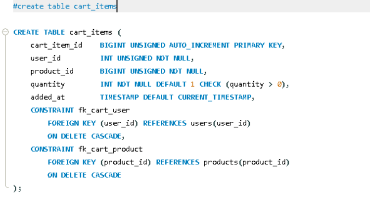

```markdown
Let's understand the `cart_items` table — it introduces a new and crucial concept: a **composite unique key** (combining two columns to make them unique together).

```sql
CREATE TABLE cart_items (

```

A new table named **`cart_items`** — this serves as a temporary storage area for when a user adds products to their cart before checkout (when the order hasn't been confirmed yet).

---

```sql
cart_item_id BIGINT UNSIGNED AUTO_INCREMENT PRIMARY KEY,

```

* The unique, auto-generated ID for every individual cart entry.

---

```sql
user_id BIGINT UNSIGNED NOT NULL,
product_id BIGINT UNSIGNED NOT NULL,

```

* These are two **Foreign Key columns** — they indicate "which user" is adding "which product" to their cart.
* **`NOT NULL`** — Both must be present. A cart item must have both a user and a product; an entry without either is meaningless.
* *Note:* This acts as a bridge/junction table between the `users` and `products` tables — establishing a **Many-to-Many relationship** (one user can have many products in their cart, and one product can exist in many users' carts).

---

```sql
quantity INT NOT NULL DEFAULT 1 CHECK (quantity > 0),

```

* **`INT`** — A whole number (you cannot add 0.5 of a product to a cart).
* **`DEFAULT 1`** — If no quantity is specified, it defaults to 1 (when a user clicks "Add to Cart", it usually starts with 1 item).
* **`CHECK (quantity > 0)`** — Note the difference here: previous tables used `CHECK (price >= 0)` (where 0 was allowed), but here it is `> 0`, meaning **0 is not allowed**. The logic is simple: if the quantity drops to 0, there is no reason for that item to remain in the cart — the row should simply be deleted. Keeping a row with a 0 quantity would result in bad, illogical data.

---

```sql
added_at TIMESTAMP DEFAULT CURRENT_TIMESTAMP,

```

* Automatically records exactly when the item was added to the cart. This is highly useful for business logic like generating "abandoned cart" reports (tracking items that have been sitting in carts for days without becoming actual orders).

---

```sql
CONSTRAINT fk_cart_user
    FOREIGN KEY (user_id) REFERENCES users(user_id)
    ON DELETE CASCADE,
CONSTRAINT fk_cart_product
    FOREIGN KEY (product_id) REFERENCES products(product_id)
    ON DELETE CASCADE,

```

Two separate foreign keys, both using `CASCADE`:

* **If a user is deleted** → all of their cart items are automatically deleted (logical: if there is no user, their cart shouldn't exist).
* **If a product is deleted** → that product is automatically removed from the carts of all users who had added it (logical: if a product is permanently removed from the store, no one can keep it in their cart).
* Having two foreign keys confirms that `cart_items` is truly a junction table physically connecting users and products.

---

```sql
UNIQUE KEY uq_cart_user_product (user_id, product_id),

```

This is the newest and most important concept — a **composite unique constraint** (making two columns unique *together*):

* This means a specific combination of `user_id` and `product_id` can only appear **once** in the entire table.
* **Real-world scenario:** If Rahul (`user_id` 5) has already added a "Samsung Galaxy M14" (`product_id` 10) to his cart, he cannot add that exact same product again to create a new row. Instead, the application logic should simply update the quantity of the existing row (e.g., changing it from 1 to 2).
* This prevents duplicate cart entries. Without this constraint, clicking "Add to Cart" three times would create three separate rows (quantity=1 three times), which is bad design. Instead, there will be just one row with quantity=3.
* `user_id` and `product_id` are not uniquely individual here (one user can have many products; one product can be in many carts) — but their combination *together* is unique. That is why both columns are written together inside brackets: `(user_id, product_id)`.


---

**Summary in one line:**
The `cart_items` table is a junction table connecting users and products (Many-to-Many), uses a `quantity > 0` constraint to block zero-quantity items, applies `CASCADE` delete to both foreign keys (cart entries vanish if the user or product is deleted), and most importantly, uses a `UNIQUE KEY (user_id, product_id)` to ensure a user can only have one row per product in their cart, preventing duplicate entries.

### 💡 New Concept Introduced: Unique Keys

| Concept | What it does | Example |
| --- | --- | --- |
| **Single-column UNIQUE** | Every value in this single column must be completely different. | `email` in the `users` table. |
| **Composite UNIQUE KEY** | The *combination* of two (or more) columns must be different, even if individual values repeat. | `(user_id, product_id)` in the `cart_items` table. |

```

```

Hinglish Explanation

Chaliye is `cart_items` table ko samjhte hain — isme ek naya aur important concept hai: **composite unique key** (do columns ko milakar unique banana).

```sql
CREATE TABLE cart_items (
```
Naya table **`cart_items`** — yeh temporary storage hai, jab user checkout se pehle products ko cart me daalta hai (abhi tak order confirm nahi hua).

---

```sql
cart_item_id BIGINT UNSIGNED AUTO_INCREMENT PRIMARY KEY,
```
- Har cart entry ka apna unique, auto-generated ID.

---

```sql
user_id BIGINT UNSIGNED NOT NULL,
product_id BIGINT UNSIGNED NOT NULL,
```
- Yeh **do Foreign Key columns hain** — batate hain "kaunsa user" "kaunsa product" apne cart me daal raha hai.
- Dono **`NOT NULL`** — cart item ke liye user aur product dono hona zaroori hai, in dono ke bina entry ka koi matlab nahi.
- Yeh table `users` aur `products` ke beech ka ek **bridge/junction table** hai — Many-to-Many relationship banata hai (ek user ke cart me kai products ho sakte hain, aur ek product kai users ke carts me ho sakta hai).

---

```sql
quantity INT NOT NULL DEFAULT 1 CHECK (quantity > 0),
```
- **`INT`** — whole number (0.5 quantity nahi ho sakti).
- **`DEFAULT 1`** — agar quantity specify nahi ki, to by-default 1 maana jaayega (jab user "Add to Cart" click karta hai, usually 1 quantity se start hota hai).
- **`CHECK (quantity > 0)`** — yahan dhyan do, pichli tables me `CHECK (price >= 0)` tha (0 allowed tha), lekin yahan **`> 0`** hai, matlab **0 allowed nahi hai**. Logic simple hai: agar quantity 0 ho jaaye, to us item ka cart me hona hi kya matlab — usse to cart se hata dena chahiye (delete row), 0 quantity wala row rakhna galat data hoga.

---

```sql
added_at TIMESTAMP DEFAULT CURRENT_TIMESTAMP,
```
- Item cart me kab add hua, yeh automatically record hota hai. Yeh useful hai jaise "abandoned cart" reports banane ke liye (jo items bahut purane se cart me pade hain lekin order nahi bane).

---

```sql
CONSTRAINT fk_cart_user
    FOREIGN KEY (user_id) REFERENCES users(user_id)
    ON DELETE CASCADE,
CONSTRAINT fk_cart_product
    FOREIGN KEY (product_id) REFERENCES products(product_id)
    ON DELETE CASCADE,
```
- Do alag foreign keys, dono **`CASCADE`** ke saath:
  - Agar **user delete** ho jaaye → uske sab cart items automatically delete ho jaayenge (logical hai, user hi nahi to uska cart kaise rahega).
  - Agar **product delete** ho jaaye → wo product jitne bhi users ke carts me tha, wahan se bhi automatically hat jaayega (agar product store se hi hata diya, to koi use cart me nahi rakh sakta).
- Do foreign keys hone se yeh confirm hota hai ki `cart_items` sach me `users` aur `products` dono ko connect karne wala junction table hai.

---

```sql
UNIQUE KEY uq_cart_user_product (user_id, product_id),
```
Yeh sabse naya aur important concept hai — **composite unique constraint** (do columns ko saath me unique banana):

- Iska matlab: **ek specific `user_id` aur `product_id` ka combination sirf ek hi baar table me ho sakta hai.**
- Real-world me iska matlab: agar Rahul ne apne cart me "Samsung Galaxy M14" already daal rakha hai, to wo dobara wahi product add nahi kar sakta — ek **naya row nahi banega**, balki application logic me existing row ki `quantity` ko update kiya jaayega (jaise 1 se 2 karna).
- Isse duplicate cart entries rokte hain — bina iske, agar user 3 baar "Add to Cart" dabaye, to 3 alag rows ban jaate (`quantity=1` teen baar), jo galat hota. Iske bajaye ek hi row rahegi with `quantity=3`.
- Yeh **`user_id` aur `product_id` individually** unique nahi hain (ek user ke cart me kai products ho sakte hain, ek product kai carts me ho sakta hai) — lekin **dono ka combination together** unique hai. Isliye ismein dono columns ko bracket me saath likha gaya: `(user_id, product_id)`.


---

**Summary ek line me:** `cart_items` ek junction table hai jo `users` aur `products` ko connect karta hai (Many-to-Many), `quantity > 0` constraint zero-quantity items ko rokta hai, dono foreign keys `CASCADE` delete ke saath hain (user ya product delete hone par cart entry bhi hat jaati hai), aur sabse important — `UNIQUE KEY (user_id, product_id)` ensure karta hai ki ek user ek product ko cart me sirf ek hi row me rakh sake, duplicate entries na banein.

**Naya concept jo yahan pehli baar aaya:**
| Concept | Kya karta hai |
|---|---|
| Single-column `UNIQUE` (jaise `email`) | Ek column ki har value alag honi chahiye |
| Composite `UNIQUE KEY (col1, col2)` | Do (ya zyada) columns ka **combination** alag hona chahiye, individually nahi |
