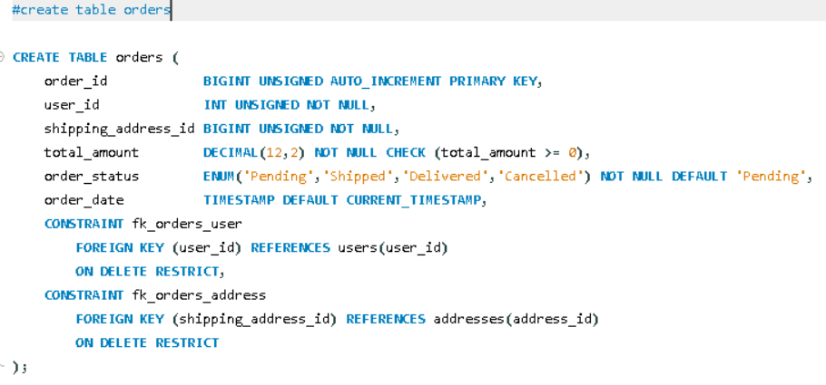

English Explanation


```markdown
Let's understand the `orders` table — this is the most critical table in your entire system, and it introduces a new data type: `ENUM`.

```sql
CREATE TABLE orders (

```

A new table named **`orders`** — when a user checks out from their cart, an order record is created here. This acts as the "header" of the order (storing basic info); the actual product details inside the order will be tracked in a separate `order_items` table.

---

```sql
order_id BIGINT UNSIGNED AUTO_INCREMENT PRIMARY KEY,

```

* The unique, auto-generated ID for every order.

---

```sql
user_id BIGINT UNSIGNED NOT NULL,

```

* A **Foreign Key** — indicating which user placed this order.
* **`NOT NULL`** — Every order must necessarily be linked to a user.

---

```sql
shipping_address_id BIGINT UNSIGNED NOT NULL,

```

* Another **Foreign Key** — but this one points to the `addresses` table, indicating where the order will be delivered.
* Remember, a single user can have multiple addresses (in the `addresses` table), so this column specifies exactly *which* address was selected for this specific order.

---

```sql
total_amount DECIMAL(12,2) NOT NULL CHECK (total_amount >= 0),

```

* **`DECIMAL(12,2)`** — Pay attention here: `products.price` used `DECIMAL(10,2)`, but here we use `DECIMAL(12,2)`. This allows for larger digits (12 total digits vs 10). Why? Because while a single product's price might be small, an order's total (the sum of multiple products) can be massive — hence, a larger range is needed.
* **`CHECK (total_amount >= 0)`** — A negative order total is mathematically impossible, so this prevents invalid data (just like with `products.price`).

---

```sql
order_status ENUM('Pending','Shipped','Delivered','Cancelled') NOT NULL DEFAULT 'Pending',

```

This is where the **`ENUM`** data type appears for the first time — a highly useful concept:

* `ENUM` means that this column can **only** contain one of the explicitly listed values: 'Pending', 'Shipped', 'Delivered', or 'Cancelled'. If you attempt to insert a 5th value (like 'Returned' or a typo like 'Pendingg'), the database will instantly throw an error.
* This is far superior to `VARCHAR` when you know the values must belong to a strictly fixed, limited set. It guarantees data quality at the database level itself, rather than relying on application code to catch mistakes.
* **`DEFAULT 'Pending'`** — Whenever a new order is created, its status defaults to "Pending" (which is logical, as an order that has just been placed is neither shipped nor delivered yet).
* *Fun Fact:* Internally, MySQL stores ENUM values as numbers (1, 2, 3, 4) in a highly storage-efficient way, but you will always see and retrieve them as text when querying.

---

```sql
order_date TIMESTAMP DEFAULT CURRENT_TIMESTAMP,

```

* Automatically records exactly when the order was placed.

---

```sql
CONSTRAINT fk_orders_user
    FOREIGN KEY (user_id) REFERENCES users(user_id)
    ON DELETE RESTRICT,
CONSTRAINT fk_orders_address
    FOREIGN KEY (shipping_address_id) REFERENCES addresses(address_id)
    ON DELETE RESTRICT,

```

Two foreign keys, both using **`ON DELETE RESTRICT`** (a behavior similar to the `products` table, but completely different from the `CASCADE` used in `addresses` and `cart_items`):

* **User RESTRICT:** If a user has a history of orders, that user *cannot* be deleted. This is a critical business and legal requirement: order history must be preserved for records (accounting, taxes, refund/dispute handling). If this were set to `CASCADE`, deleting a user would wipe out all their past orders, destroying vital financial data.
* **Address RESTRICT:** Similarly, if an address has been used in an order, that specific address cannot be deleted. The order record must always maintain historical accuracy about "where this delivery was made," even if the user removes that address from their profile.

**An Important Design Decision:**

* In the `addresses` table: `user_id` → **CASCADE** (Deleting a user deletes their addresses).
* In the `orders` table: `user_id` → **RESTRICT** (A user can only be deleted if they have no orders).
* *Meaning:* You can freely delete a user who has never placed an order. But once an order is placed, that user's account becomes a permanent reference in the system — you would have to handle their order history first before account deletion is possible.


---

**Summary in one line:**
The `orders` table stores the header record of an order — detailing who ordered, where it will be delivered, the total amount, and the status (guaranteed via fixed `ENUM` values) — while both foreign keys use `RESTRICT` to legally and logically preserve critical business history, preventing the deletion of users or addresses linked to past orders.

### 💡 Complete Comparison of `ON DELETE` Behaviors Used So Far

| Behavior | What Happens? | Where/Why is it used? |
| --- | --- | --- |
| **CASCADE** | The child row is also deleted. | `addresses`, `cart_items` (Used for temporary or dependent data). |
| **SET NULL** | The child row remains, but the link becomes NULL. | `categories` (Used to prevent breaking a hierarchy structure). |
| **RESTRICT** | Deletion is entirely blocked. | `products`, `orders` (Used to preserve historical and business-critical data). |

```

```
Hinglish Explanation

Chaliye is `orders` table ko samjhte hain — yeh aapke pure system ka sabse critical table hai, aur isme ek naya data type bhi hai: **`ENUM`**.

```sql
CREATE TABLE orders (
```
Naya table **`orders`** — jab user cart se checkout karta hai, to ek order record yahan create hota hai. Yeh order ka "header" hai (basic info), actual products ka detail alag `order_items` table me hoga.

---

```sql
order_id BIGINT UNSIGNED AUTO_INCREMENT PRIMARY KEY,
```
- Har order ka unique, auto-generated ID.

---

```sql
user_id BIGINT UNSIGNED NOT NULL,
```
- **Foreign Key** — yeh order kis user ne place kiya, batata hai.
- **`NOT NULL`** — har order kisi user se linked hona zaroori hai.

---

```sql
shipping_address_id BIGINT UNSIGNED NOT NULL,
```
- Ek aur **Foreign Key** — lekin yeh `addresses` table ko point karta hai, batata hai order kis address par deliver hoga.
- Yaad karo, ek user ke multiple addresses ho sakte hain (`addresses` table me), to yahan specify hota hai ki **is particular order ke liye kaunsa address use hua**.

---

```sql
total_amount DECIMAL(12,2) NOT NULL CHECK (total_amount >= 0),
```
- **`DECIMAL(12,2)`** — dhyan do, `products.price` me `DECIMAL(10,2)` tha, lekin yahan **`DECIMAL(12,2)`** hai — bade digits allowed hain (12 total digits vs 10). Kyun? Kyunki ek single product ka price chhota ho sakta hai, lekin ek **order ka total** (multiple products ka sum) bahut bada ho sakta hai — isliye zyada range chahiye.
- **`CHECK (total_amount >= 0)`** — negative order total possible nahi (jaisa `products.price` me tha).

---

```sql
order_status ENUM('Pending','Shipped','Delivered','Cancelled') NOT NULL DEFAULT 'Pending',
```
Yahan pehli baar **`ENUM`** data type aaya hai — yeh naya aur important concept hai:

- **`ENUM`** ka matlab hai — is column me **sirf** in listed values me se koi ek value aa sakti hai: `'Pending'`, `'Shipped'`, `'Delivered'`, ya `'Cancelled'`. Koi 5th value (jaise `'Returned'` ya typo `'Pendingg'`) insert karne ki koshish karoge to database error de dega.
- Yeh `VARCHAR` se better hai jab aapko pata ho ki values ek fixed, limited set me se hi honi chahiye — isse **data quality guaranteed** hoti hai database level par hi, application code par depend nahi karna padta.
- **`DEFAULT 'Pending'`** — jab bhi naya order create hota hai, by-default uska status "Pending" set ho jaata hai (logical hai, order abhi-abhi place hua hai, na to shipped hua hai na delivered).
- Internally MySQL `ENUM` values ko numbers (1, 2, 3, 4) ki tarah store karta hai storage-efficient tarike se, lekin aapko text hi dikhta/milta hai use karte waqt.

---

```sql
order_date TIMESTAMP DEFAULT CURRENT_TIMESTAMP,
```
- Order kab place hua, automatically record hota hai.

---

```sql
CONSTRAINT fk_orders_user
    FOREIGN KEY (user_id) REFERENCES users(user_id)
    ON DELETE RESTRICT,
CONSTRAINT fk_orders_address
    FOREIGN KEY (shipping_address_id) REFERENCES addresses(address_id)
    ON DELETE RESTRICT,
```
- Do foreign keys, dono **`ON DELETE RESTRICT`** ke saath (`products` table jaisa behavior, `addresses`/`cart_items` ke `CASCADE` se different):
- **User wala RESTRICT** — agar us user ka koi order history hai, to us user ko delete nahi kiya jaa sakta. Yeh bahut zaroori business/legal reason hai: **order history record ke taur par preserve honi chahiye** (accounting, tax, refund/dispute handling ke liye) — agar `CASCADE` hota, to user delete hote hi uske saare purane orders bhi gayab ho jaate, jo galat hota.
- **Address wala RESTRICT** — isi tarah, agar koi address kisi order me use ho chuka hai, to wo address delete nahi ho sakta. Order record me hamesha pata hona chahiye "yeh delivery kahan hui thi", chahe user apna address list update/delete kar de.

**Yeh ek important design decision hai jo pichli tables se different socha gaya:**
- `addresses` table me `user_id` → `CASCADE` tha (user delete hote hi uske address delete)
- Lekin `orders` table me `user_id` → `RESTRICT` hai (user delete tabhi hoga jab uske orders na ho)

Iska matlab: jab tak user ne koi order place nahi kiya, use freely delete kar sakte ho, lekin ek baar order ho gaya, to us user ka account permanently reference ban jaata hai — pehle order history sambhalni padegi.


---

**Summary ek line me:** `orders` table order ka header record store karta hai — kisne order kiya, kahan deliver hoga, total kitna hai, aur status kya hai (`ENUM` se fixed values guarantee hoti hain). Dono foreign keys `RESTRICT` hain kyunki order history business/legal reason se preserve honi zaroori hai — user ya address ko delete karne se pehle order history handle karni padegi.

**Ab tak dekhe gaye saare `ON DELETE` patterns ka poora comparison:**
| Behavior | Kya hota hai | Kahan/Kyun use hua |
|---|---|---|
| `CASCADE` | Child bhi delete ho jaata hai | `addresses`, `cart_items` (temporary/dependent data) |
| `SET NULL` | Child rehta hai, link NULL ho jaata hai | `categories` (hierarchy tootne se bachana) |
| `RESTRICT` | Delete hi block ho jaata hai | `products`, `orders` (historical/business-critical data preserve karna) |


