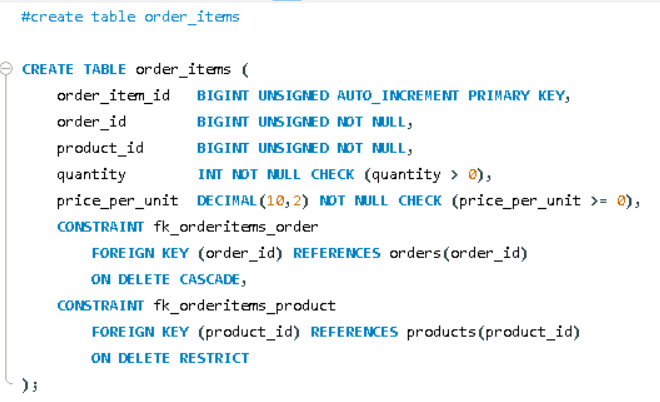

```markdown
Let's understand the `order_items` table — this table demonstrates a highly important real-world business logic: the concept of a "price snapshot".

```sql
CREATE TABLE order_items (

```

A new table named **`order_items`** — when an order is placed containing multiple products, each product's entry is stored here in a separate row. This is a junction/bridge table between `orders` and `products` (similar to the concept of `cart_items`, but for confirmed orders instead of a temporary cart).

---

```sql
order_item_id BIGINT UNSIGNED AUTO_INCREMENT PRIMARY KEY,

```

* The unique, auto-generated ID for each order line item.

---

```sql
order_id BIGINT UNSIGNED NOT NULL,
product_id BIGINT UNSIGNED NOT NULL,

```

* Two **Foreign Key columns** — indicating "which order" contains "which product".
* Both are **`NOT NULL`** — without an order and a product, a line item has no meaning.
* *Note:* If a single order contains 3 different products, 3 separate rows will be created in this table. All 3 rows will share the same `order_id`, but will have different `product_id`s.

---

```sql
quantity INT NOT NULL CHECK (quantity > 0),

```

* How many units of this product were ordered (similar to `cart_items`).
* **`CHECK (quantity > 0)`** — 0 or negative quantities are not allowed.
* *Pay Attention:* There is no `DEFAULT 1` here (unlike in `cart_items`). This is because, for a confirmed order, the exact quantity must be explicitly provided during checkout; the system shouldn't rely on a "default guess".

---

```sql
price_per_unit DECIMAL(10,2) NOT NULL CHECK (price_per_unit >= 0), -- price at time of order

```

This is the **most important and interesting column** in this entire table:

* Notice the comment: `-- price at time of order` (This is an SQL comment, it doesn't execute; it's just for explanation).
* **Question:** Since the `products` table already has a `price` column, why are we storing `price_per_unit` separately in `order_items`? Why not just reference `products.price` (using a `JOIN`) when viewing the order?
* **Answer — A critical real-world business rule:** Product prices change over time (today a smartphone might be ₹12,999, but tomorrow it might drop to ₹10,999 during a sale).
* If we don't store the price in `order_items` and solely rely on `products.price`, the total amount of *past* orders would automatically change whenever the live product price changes — which is completely wrong!
* **Example:** You order a product on January 1st for ₹12,999. If the company increases the price to ₹15,999 on February 1st, your January 1st invoice and order history must still show ₹12,999 (what you actually paid), not the new current price.
* Therefore, `order_items.price_per_unit` permanently **"freezes"** or captures a **"snapshot"** of the exact price at the moment the order was placed — regardless of how much `products.price` fluctuates in the future.


* **`NOT NULL CHECK (price_per_unit >= 0)`** — Standard validation to ensure the price cannot be negative.

---

```sql
CONSTRAINT fk_orderitems_order
    FOREIGN KEY (order_id) REFERENCES orders(order_id)
    ON DELETE CASCADE,

```

* `order_id` references `orders.order_id`.
* **`ON DELETE CASCADE`** — If (in a rare scenario) an entire order is deleted, all of its individual line items (`order_items`) will also be automatically deleted. This is perfectly logical: if the parent order no longer exists, its individual items have no purpose.

---

```sql
CONSTRAINT fk_orderitems_product
    FOREIGN KEY (product_id) REFERENCES products(product_id)
    ON DELETE RESTRICT,

```

* `product_id` references `products.product_id`.
* **`ON DELETE RESTRICT`** — If a product has been purchased and exists in any order, that product **cannot** be deleted. The reason is the same as the `RESTRICT` rule in the `orders` table: preserving accurate historical records. If the product were allowed to be deleted (`CASCADE`), its name and details would vanish from past order histories, ruining past invoices.

*Notice:* This table has two foreign keys, but their behaviors differ entirely. Deleting an order deletes its items (`CASCADE`), but deleting a product is blocked if it belongs to an order (`RESTRICT`). This highlights that `order_id` is an "owning" relationship (the item belongs to the order), while `product_id` is merely a "reference" that must be legally preserved.


---

**Summary in one line:**
The `order_items` table stores the individual line-item details of every product inside an order; crucially, the `price_per_unit` column permanently "freezes" the price at the exact time of the order to ensure historical invoices remain accurate even if prices change later, while `CASCADE` manages order deletion and `RESTRICT` protects product deletion to preserve order history.

### 💡 New Business-Logic Concept Introduced: Snapshot vs. Live Reference

| Concept | What it is | Example |
| --- | --- | --- |
| **Live Reference** | Always displays the current/latest value. | `products.price` — The active price on the storefront. |
| **Snapshot/Frozen Value** | A value that is permanently locked at a specific point in time. | `order_items.price_per_unit` — The price locked in at the time of checkout. |

*(Note: You will see this snapshot concept everywhere in real-world systems — such as invoices, bank statements, and receipts — where historical accuracy is much more important than live data.)*

```

```

Hinglish Explanation

Chaliye is `order_items` table ko samjhte hain — yeh table ek bahut important real-world business logic dikhata hai: **"price snapshot"** ka concept.

```sql
CREATE TABLE order_items (
```
Naya table **`order_items`** — jab ek order place hota hai jisme multiple products ho sakte hain, to har product ki entry yahan ek alag row me store hoti hai. Yeh `orders` aur `products` ke beech ka **junction/bridge table** hai (`cart_items` jaisa hi concept, bas cart ki jagah confirmed order ke liye).

---

```sql
order_item_id BIGINT UNSIGNED AUTO_INCREMENT PRIMARY KEY,
```
- Har order line-item ka apna unique, auto-generated ID.

---

```sql
order_id BIGINT UNSIGNED NOT NULL,
product_id BIGINT UNSIGNED NOT NULL,
```
- Do **Foreign Key columns** — batate hain "kaunsa order" me "kaunsa product" shaamil hai.
- Dono **`NOT NULL`** — bina order aur product ke, line-item ka koi matlab nahi.
- Ek order me 3 products hain to isme 3 rows banenge, sabka `order_id` same hoga par `product_id` alag-alag.

---

```sql
quantity INT NOT NULL CHECK (quantity > 0),
```
- Kitni units order ki gayi (jaise `cart_items` me tha).
- **`CHECK (quantity > 0)`** — 0 ya negative quantity allowed nahi, jaisa `cart_items` me bhi tha.
- Dhyan do: yahan `DEFAULT 1` nahi hai (jo `cart_items` me tha) — kyunki confirmed order me quantity **explicitly** honi chahiye, checkout ke time system ko exact quantity pata honi chahiye, "default guess" allow nahi karna.

---

```sql
price_per_unit DECIMAL(10,2) NOT NULL CHECK (price_per_unit >= 0), -- price at time of order
```
Yeh **sabse important aur interesting column** hai is poore table me:

- Yahan comment bhi diya gaya hai: `-- price at time of order` (yeh SQL comment hai, code execute nahi hota, sirf explanation ke liye hai).
- **Sawaal:** Jab `products` table me already `price` column hai, to `order_items` me alag se `price_per_unit` kyun store kar rahe hain? Kyu na order ke time `products.price` ko hi refer kar liya jaaye (JOIN karke)?
- **Jawaab — yeh ek critical real-world business rule hai:**
  - Products ke price time ke saath badalte rehte hain (aaj Samsung Galaxy M14 ka price ₹12,999 hai, kal discount lagne se ₹10,999 ho sakta hai).
  - Agar hum `order_items` me price store hi na karein aur sirf `products.price` par depend rahein, to **purane orders ka total automatically badal jaayega** jab bhi product ka current price change hoga — jo bilkul galat hai!
  - Example: Aapne 1 January ko ek product ₹12,999 me order kiya. Agar company 1 February ko us product ka price ₹15,999 kar de, to aapki 1 January ki invoice/order history **abhi bhi ₹12,999 hi dikhani chahiye** — jo aapne actually pay kiya tha, na ki current price.
  - Isliye `order_items.price_per_unit` order place hone ke exact time ka price **"freeze"/"snapshot"** kar leta hai, permanently — chahe `products.price` baad me kitna bhi badal jaaye.
- **`NOT NULL CHECK (price_per_unit >= 0)`** — pehle jaisa hi validation, negative price allowed nahi.

---

```sql
CONSTRAINT fk_orderitems_order
    FOREIGN KEY (order_id) REFERENCES orders(order_id)
    ON DELETE CASCADE,
```
- `order_id` → `orders.order_id` ko reference karta hai.
- **`ON DELETE CASCADE`** — agar (rare case me) koi poora order hi delete ho jaaye, to uske saare line-items (order_items) bhi automatically delete ho jaayenge. Logical hai — order hi nahi bacha to uske individual items ka bhi koi matlab nahi.

---

```sql
CONSTRAINT fk_orderitems_product
    FOREIGN KEY (product_id) REFERENCES products(product_id)
    ON DELETE RESTRICT,
```
- `product_id` → `products.product_id` ko reference karta hai.
- **`ON DELETE RESTRICT`** — agar koi product kisi order me use ho chuka hai, to us product ko delete nahi kiya jaa sakta. Yeh `orders` table ke `RESTRICT` jaisa hi reason hai: **order history preserve honi chahiye**. Agar product delete ho jaata (CASCADE hota), to purane orders ke record se product ka naam hi gayab ho jaata — jo invoice/history ke liye galat hoga.
- Dhyan do — is table me do foreign keys hain, lekin dono ka behavior **alag** hai: order delete hone par item delete (CASCADE), lekin product delete hi allowed nahi jab tak order ho (RESTRICT). Yeh dikhata hai ki `order_id` "owning" relationship hai (item order ka hissa hai), jabki `product_id` sirf ek "reference" hai jo preserve hona chahiye.


---

**Summary ek line me:** `order_items` table ek order ke andar har product ki line-item detail store karta hai, aur sabse important — `price_per_unit` column order ke exact time ka price permanently "freeze" kar leta hai, taaki agar future me product ka price change ho, to purani order history/invoice accurate hi rahe. `order_id` CASCADE hai (order delete → items bhi delete) jabki `product_id` RESTRICT hai (order history ke liye product delete block ho jaata hai).

**Yeh naya business-logic concept jo yahan pehli baar aaya:**
| Concept | Kya hai |
|---|---|
| Live reference | `products.price` — hamesha current/latest price dikhata hai |
| Snapshot/frozen value | `order_items.price_per_unit` — jis time order hua tha, us waqt ka price hamesha ke liye fix ho jaata hai |

Isi tarah ka concept aapko real duniya ke bahut se systems me milega — jaise invoices, bank statements, receipts — jahan "historical accuracy" current data se zyada zaroori hoti hai.

