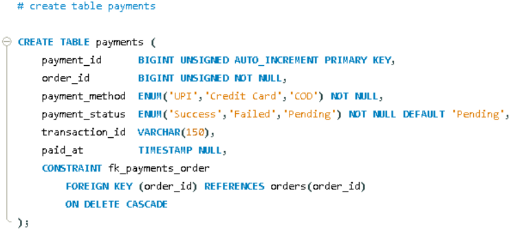

English Explanation


```markdown
Let's understand the `payments` table:

```sql
CREATE TABLE payments (

```

A new table named **`payments`** — the payment record for every order is stored here, including which payment method was used and whether the transaction was successful or not.

---

```sql
payment_id BIGINT UNSIGNED AUTO_INCREMENT PRIMARY KEY,

```

* The unique, auto-generated ID for each payment record.

---

```sql
order_id BIGINT UNSIGNED NOT NULL,

```

* A **Foreign Key** — indicating which order this payment belongs to.
* **`NOT NULL`** — A payment record cannot exist without being linked to an order.

---

```sql
payment_method ENUM('UPI','Credit Card','COD') NOT NULL,

```

* **`ENUM`** — Just like we saw in `orders.order_status`, only strictly fixed values are allowed here: 'UPI', 'Credit Card', or 'COD' (Cash on Delivery). Attempting to insert a 4th value (like a typo 'upi' in lowercase or 'Net Banking') will be rejected by the database unless explicitly added to this list.
* **`NOT NULL`** — Specifying the payment method is mandatory; a payment record cannot exist without it.
* *Note:* There is no `DEFAULT` value here. This means the user must explicitly select a payment method during checkout; the system won't automatically assume one.

---

```sql
payment_status ENUM('Success','Failed','Pending') NOT NULL DEFAULT 'Pending',

```

* Another **`ENUM`**, representing the current status of the payment process: 'Success', 'Failed', or 'Pending'.
* **`DEFAULT 'Pending'`** — When the payment record is first created (as soon as the checkout process begins), the status is "Pending" by default — it is not yet confirmed whether it succeeded or failed. Later, when the payment gateway sends a response, the application code will update this to either 'Success' or 'Failed'.

---

```sql
transaction_id VARCHAR(150),

```

* The unique transaction reference number provided by the payment gateway (e.g., Razorpay, Paytm, or a bank), looking something like `TXN20260603A1`.
* **Why is it NOT NULL absent?** Because COD (Cash on Delivery) payments do not generate an online transaction ID (the customer hands over cash at the time of delivery). Therefore, this field is kept optional so it can be left `NULL` for COD orders.
* Similarly, if a payment is still 'Pending' (waiting for the gateway's response), the `transaction_id` will remain `NULL` until confirmed.

---

```sql
paid_at TIMESTAMP NULL,

```

Here is an interesting difference from previous tables:

* In previous tables, we used `created_at TIMESTAMP DEFAULT CURRENT_TIMESTAMP` — which automatically set the current time the moment a row was inserted.
* But here, we only use **`TIMESTAMP NULL`** without a default. This means this column explicitly allows `NULL` values and does **not** auto-fill.
* **Why?** Because the "time the record was created" and the "time the payment actually succeeded" are two completely different events:
* When the payment record is inserted (at checkout), the payment is still 'Pending' — the money hasn't actually been received yet. Filling `paid_at` at this exact moment would be factually incorrect.
* Only when the payment gateway confirms the transaction was successful (`payment_status = 'Success'`), will the application code manually update `paid_at` with the current time.
* If the payment 'Failed', `paid_at` will remain `NULL` forever — because the money was never received.


* This perfectly reflects real-world business logic: `paid_at` represents "when the money was actually received," not "when the database record was created."

---

```sql
CONSTRAINT fk_payments_order
    FOREIGN KEY (order_id) REFERENCES orders(order_id)
    ON DELETE CASCADE,

```

* `order_id` references `orders.order_id`.
* **`ON DELETE CASCADE`** — If an order is deleted (in a rare scenario), its corresponding payment record will also be automatically deleted. This is the same logic used in `order_items`: a payment record cannot exist as a standalone entity; it must always be attached to an order.


---

**Summary in one line:**
The `payments` table tracks the payment record for every order — storing the method (`ENUM`), current status (`ENUM`, defaulting to Pending), and transaction details; both `transaction_id` and `paid_at` are intentionally left optional/`NULL` because COD payments lack transaction IDs, and `paid_at` is only populated when a payment is genuinely successful — accurately reflecting a real business timeline.

### 💡 New Concept Introduced: Timestamp Timing

| Concept | Meaning |
| --- | --- |
| **`TIMESTAMP DEFAULT CURRENT_TIMESTAMP`** | The exact time the "record was created" — happens automatically. |
| **`TIMESTAMP NULL`** *(without a default)* | The time a specific business event happens — updated manually by the application code *only* when that event actually occurs. |

```

```

Hinglish Explanation

Chaliye is `payments` table ko samjhte hain:

```sql
CREATE TABLE payments (
```
Naya table **`payments`** — har order ka payment record yahan store hota hai: kaunsa method use hua, payment successful hua ya nahi.

---

```sql
payment_id BIGINT UNSIGNED AUTO_INCREMENT PRIMARY KEY,
```
- Har payment record ka apna unique, auto-generated ID.

---

```sql
order_id BIGINT UNSIGNED NOT NULL,
```
- **Foreign Key** — batata hai yeh payment kis order ke liye hai.
- **`NOT NULL`** — payment record bina order ke exist nahi kar sakta.

---

```sql
payment_method ENUM('UPI','Credit Card','COD') NOT NULL,
```
- **`ENUM`** — jaisa `orders.order_status` me dekha tha, yahan bhi sirf fixed values allowed hain: `'UPI'`, `'Credit Card'`, ya `'COD'` (Cash on Delivery). Koi 4th value (jaise typo `'upi'` lowercase ya `'Net Banking'`) insert nahi hoga jab tak list me add na ho.
- **`NOT NULL`** — payment method batana zaroori hai, koi payment record bina method ke nahi ho sakta.
- Yahan `DEFAULT` nahi diya gaya — matlab user ko explicitly checkout ke time payment method select karna hi hoga, koi automatic default nahi.

---

```sql
payment_status ENUM('Success','Failed','Pending') NOT NULL DEFAULT 'Pending',
```
- Ek aur **`ENUM`**, payment process ka current status: `'Success'`, `'Failed'`, ya `'Pending'`.
- **`DEFAULT 'Pending'`** — jab payment record pehli baar create hota hai (payment process shuru hote hi), by-default status "Pending" hota hai — abhi confirm nahi hua ki successful hua ya fail. Baad me jab payment gateway response aata hai, application code isse `'Success'` ya `'Failed'` me update kar dega.

---

```sql
transaction_id VARCHAR(150),
```
- Payment gateway (jaise Razorpay, Paytm, bank) se milne wala unique transaction reference number (jaise `TXN20260603A1`).
- `NOT NULL` nahi hai — kyun? Kyunki **COD (Cash on Delivery)** payments me koi online transaction ID hota hi nahi (customer delivery ke time cash deta hai), isliye yeh field optional rakha gaya taaki COD orders me isse NULL chhoda jaa sake.
- Isi tarah, agar payment abhi `'Pending'` hai (gateway se response aana baaki hai), to transaction_id bhi tab tak NULL rahega.

---

```sql
paid_at TIMESTAMP NULL,
```
Yahan ek interesting difference hai pichli tables se:
- Pichli saari tables me humne dekha tha `created_at TIMESTAMP DEFAULT CURRENT_TIMESTAMP` — jisme insert hote hi automatically current time set ho jaata tha.
- Lekin yahan sirf **`TIMESTAMP NULL`** hai, koi `DEFAULT CURRENT_TIMESTAMP` nahi — matlab yeh column **explicitly NULL allow karta hai aur automatically fill nahi hota**.
- **Kyun?** Kyunki "record create hone ka time" aur "payment actually successful hone ka time" **do alag cheezein hain**:
  - Jab payment record insert hota hai (checkout shuru hote hi), payment abhi `'Pending'` hai — **paisa abhi tak actually mila hi nahi hai**, isliye `paid_at` ko us waqt bharna galat hoga.
  - Sirf jab payment gateway confirm kare ki payment successful ho gaya (`payment_status = 'Success'`), tabhi application code manually `paid_at` ko current time se update karega.
  - Agar payment `'Failed'` ho jaaye, to `paid_at` hamesha ke liye **NULL hi rahega** — kyunki paisa mila hi nahi.
- Yeh business logic ka sahi reflection hai: `paid_at` = "jab paisa actually receive hua", na ki "jab record banaya gaya".

---

```sql
CONSTRAINT fk_payments_order
    FOREIGN KEY (order_id) REFERENCES orders(order_id)
    ON DELETE CASCADE,
```
- `order_id` → `orders.order_id` ko reference karta hai.
- **`ON DELETE CASCADE`** — agar (rare case) order delete ho jaaye, to uska payment record bhi automatically delete ho jaayega. Yeh `order_items` jaisa hi CASCADE logic hai — payment record standalone kabhi exist nahi karta, hamesha kisi order se attached hota hai.


---

**Summary ek line me:** `payments` table har order ke payment ka record rakhta hai — method (`ENUM`), current status (`ENUM`, default Pending), aur transaction details. `transaction_id` aur `paid_at` dono optional/NULL rakhe gaye hain kyunki COD payments me transaction ID nahi hota, aur `paid_at` sirf tab bharega jab payment genuinely successful ho jaaye — yeh real business timeline ko accurately represent karta hai.

**Naya concept jo yahan pehli baar dikha:**
| Concept | Matlab |
|---|---|
| `TIMESTAMP DEFAULT CURRENT_TIMESTAMP` | "Record create hone" ka time — automatic |
| `TIMESTAMP NULL` (bina default ke) | Koi specific business event hone ka time — application code manually update karta hai jab wo event actually ho |

