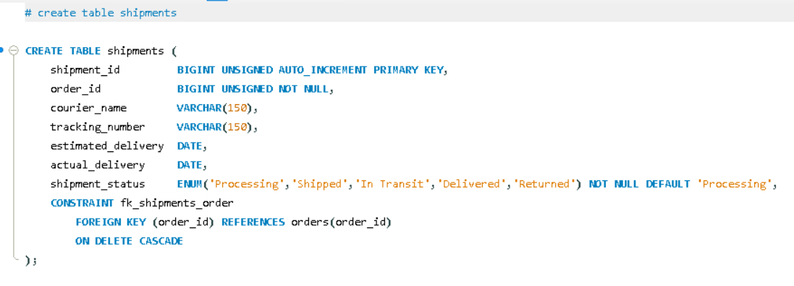

English Explanation


```markdown
Let's understand the `shipments` table — this introduces a brand new data type: `DATE` (without the time).

```sql
CREATE TABLE shipments (

```

A new table named **`shipments`** — the delivery and courier tracking details for an order are stored here.

---

```sql
shipment_id BIGINT UNSIGNED AUTO_INCREMENT PRIMARY KEY,

```

* The unique, auto-generated ID for each shipment record.

---

```sql
order_id BIGINT UNSIGNED NOT NULL,

```

* A **Foreign Key** — indicating which order this shipment belongs to.
* **`NOT NULL`** — A shipment record cannot exist without being linked to an order.

---

```sql
courier_name VARCHAR(150),

```

* The name of the delivery company (e.g., "Delhivery", "Bluedart").
* Notice there is no `NOT NULL`. It is **optional**, because when an order is still in the 'Processing' stage, a courier hasn't been assigned yet.

---

```sql
tracking_number VARCHAR(150),

```

* The tracking code provided by the courier company so the customer can track their parcel.
* This is also optional for the same reason — a tracking number isn't generated until the package is actually shipped.

---

```sql
estimated_delivery DATE,
actual_delivery     DATE,

```

Here, the **`DATE`** data type appears for the first time (instead of `TIMESTAMP`). Important things to note:

* `DATE` only stores the calendar date (e.g., 2026-07-12) and does not store the time (hours/minutes/seconds) — whereas `TIMESTAMP` stores both.
* This is the correct architectural choice because predicting the *exact time* of a delivery (like 3:45 PM) is practically impossible. Courier companies only tell you "by which day" it will be delivered, not the exact minute. Therefore, using `DATE` here is far more accurate and meaningful.
* **`estimated_delivery`** — The courier company's estimate ("it will be delivered by this date").
* **`actual_delivery`** — Once the package is actually delivered, this column is updated with the real date.
* Both are optional (no `NOT NULL`). If a shipment is just 'Processing', the estimated date might not be known yet, and the `actual_delivery` will absolutely remain `NULL` until the package genuinely reaches the customer.
* **Business Insight:** By comparing these two columns (`actual_delivery` vs `estimated_delivery`), you can easily figure out if deliveries are on time or delayed. You could run a query like: `WHERE actual_delivery > estimated_delivery` to pull a report of "late deliveries".

---

```sql
shipment_status ENUM('Processing','Shipped','In Transit','Delivered','Returned') NOT NULL DEFAULT 'Processing',

```

* Another **`ENUM`** representing the shipment's lifecycle stage. Only these 5 strictly fixed values are allowed.
* **`DEFAULT 'Processing'`** — When an order is confirmed but hasn't yet been handed over to the courier, the status defaults to "Processing".
* *Pay Attention:* This is different and much more detailed than `orders.order_status` (Pending/Shipped/Delivered/Cancelled). The `orders` table status is a high-level, business-level overview, whereas `shipments.shipment_status` provides granular, courier-level tracking (like "In Transit", which is an intermediate stage not found in the `orders` table). Because order lifecycle and logistics lifecycle are two separate concerns, they have their own dedicated status fields in separate tables.

---

```sql
CONSTRAINT fk_shipments_order
    FOREIGN KEY (order_id) REFERENCES orders(order_id)
    ON DELETE CASCADE,

```

* `order_id` references `orders.order_id`.
* **`ON DELETE CASCADE`** — If an order is deleted, its shipment record will also be automatically deleted (the exact same logic used in the `payments` table — a shipment record never exists standalone; it is permanently attached to an order).


---

**Summary in one line:**
The `shipments` table stores courier and delivery tracking details — including the courier name, tracking number, estimated vs. actual delivery dates (using the `DATE` type since exact times can't be predicted), and a highly granular shipment status (`ENUM`) that is logically separate from the high-level order status.

### 💡 New Data-Type Concept Introduced

| Data Type | What it stores | Where is it used? |
| --- | --- | --- |
| **`TIMESTAMP`** | Date + Exact Time (hours:minutes:seconds) | `created_at`, `order_date`, `paid_at` |
| **`DATE`** | Only the calendar Date, no time at all | `estimated_delivery`, `actual_delivery` |

```

```

Hinglish Explanation

Chaliye is `shipments` table ko samjhte hain — isme ek naya data type bhi hai: **`DATE`** (bina time ke).

```sql
CREATE TABLE shipments (
```
Naya table **`shipments`** — order ka delivery/courier tracking detail yahan store hota hai.

---

```sql
shipment_id BIGINT UNSIGNED AUTO_INCREMENT PRIMARY KEY,
```
- Har shipment record ka apna unique, auto-generated ID.

---

```sql
order_id BIGINT UNSIGNED NOT NULL,
```
- **Foreign Key** — batata hai yeh shipment kis order ke liye hai.
- **`NOT NULL`** — shipment record bina order ke exist nahi kar sakta.

---

```sql
courier_name VARCHAR(150),
```
- Delivery company ka naam (jaise "Delhivery", "Bluedart").
- `NOT NULL` nahi — optional, kyunki jab order abhi `'Processing'` stage me hai, courier assign hi nahi hua hoga.

---

```sql
tracking_number VARCHAR(150),
```
- Courier company se milne wala tracking code, jisse customer apna parcel track kar sake.
- Yeh bhi optional hai, same reason se — jab tak shipment actually ship na ho, tracking number generate hi nahi hota.

---

```sql
estimated_delivery DATE,
actual_delivery     DATE,
```
Yahan pehli baar **`DATE`** data type aaya hai (`TIMESTAMP` ke bajaye) — dhyan dene wali baat:

- **`DATE`** sirf date store karta hai (jaise `2026-07-12`), **time (hours/minutes/seconds) store nahi karta** — jabki `TIMESTAMP` dono (date + time) store karta hai.
- Yeh sahi choice hai kyunki delivery ka exact time (jaise 3:45 PM) predict karna practically possible nahi hota — courier companies sirf **"kis din tak deliver hoga"** batati hain, exact ghanta-minute nahi. Isliye yahan `DATE` use karna zyada accurate aur meaningful hai.
- **`estimated_delivery`** — courier company ka anumaan, "is date tak deliver ho jaayega" (jaise humne Insert_Data.sql me `2026-06-08` diya tha).
- **`actual_delivery`** — jab package **actually** deliver ho jaaye, to us real date se yeh column update hota hai.
- Dono **optional (`NOT NULL` nahi)** hain — jaise agar shipment abhi `'Processing'` hai, to estimated date bhi pata nahi ho sakti, aur `actual_delivery` to tab tak zaroor NULL rahega jab tak package genuinely deliver na ho jaaye.
- **Ek useful business insight yahan chhupa hai:** In dono columns ko compare karke (`actual_delivery` vs `estimated_delivery`) aap easily pata laga sakte ho ki delivery time par hui ya late hui — jaise ek query ban sakti hai: `WHERE actual_delivery > estimated_delivery` → "late deliveries dikhao".

---

```sql
shipment_status ENUM('Processing','Shipped','In Transit','Delivered','Returned') NOT NULL DEFAULT 'Processing',
```
- Ek aur **`ENUM`** — shipment ka lifecycle stage, sirf 5 fixed values allowed: `'Processing'`, `'Shipped'`, `'In Transit'`, `'Delivered'`, `'Returned'`.
- **`DEFAULT 'Processing'`** — jab order confirm hota hai lekin abhi courier ko handover nahi hua, by-default status "Processing" hota hai.
- Dhyan do — yeh `orders.order_status` (`Pending/Shipped/Delivered/Cancelled`) se **alag aur zyada detailed** hai. `orders` table ka status high-level/business-level hai, jabki `shipments.shipment_status` courier-level granular tracking deta hai (jaise "In Transit" ek intermediate stage hai jo orders table me nahi tha). Yeh do alag concerns hain — order lifecycle vs shipment/logistics lifecycle — isiliye alag tables me alag status fields rakhe gaye.

---

```sql
CONSTRAINT fk_shipments_order
    FOREIGN KEY (order_id) REFERENCES orders(order_id)
    ON DELETE CASCADE,
```
- `order_id` → `orders.order_id` ko reference karta hai.
- **`ON DELETE CASCADE`** — agar order delete ho jaaye, to uska shipment record bhi automatically delete ho jaayega (`payments` table jaisa hi logic — shipment standalone exist nahi karta, hamesha kisi order se attached hota hai).


---

**Summary ek line me:** `shipments` table courier aur delivery tracking detail store karta hai — kaunsa courier, tracking number, estimated vs actual delivery date (`DATE` type, kyunki exact time predict nahi ho sakta), aur granular shipment status (`ENUM`) jo `orders` table ke high-level status se alag aur zyada detailed hai.

**Naya data-type concept jo yahan pehli baar dikha:**
| Data Type | Store karta hai | Kahan use hua |
|---|---|---|
| `TIMESTAMP` | Date + exact time (hours:minutes:seconds) | `created_at`, `order_date`, `paid_at` |
| `DATE` | Sirf date, koi time nahi | `estimated_delivery`, `actual_delivery` |

