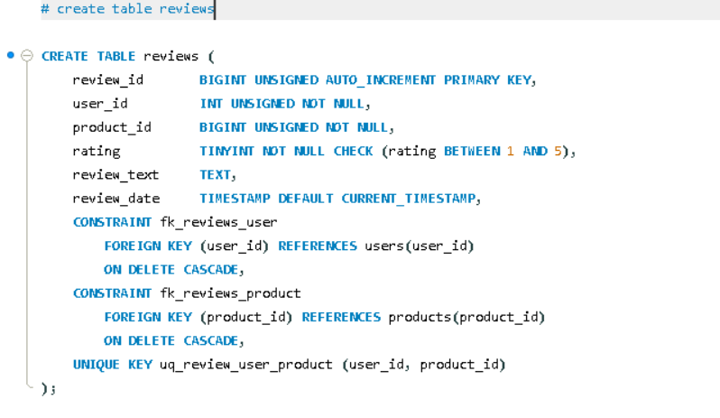

English Explanation

```markdown
Let's understand the `reviews` table — this introduces a new data type (`TINYINT`) and a new way to use the `CHECK` constraint (`BETWEEN`).

```sql
CREATE TABLE reviews (

```

A new table named **`reviews`** — users can leave ratings and reviews for products they've purchased, which are stored here.

---

```sql
review_id BIGINT UNSIGNED AUTO_INCREMENT PRIMARY KEY,

```

* The unique, auto-generated ID for each review.

---

```sql
user_id BIGINT UNSIGNED NOT NULL,
product_id BIGINT UNSIGNED NOT NULL,

```

* Two **Foreign Key columns** — indicating "which user" gave a review for "which product".
* Both are **`NOT NULL`** — a review cannot exist without being linked to a user and a product.
* *Note:* This acts as a junction/bridge table between `users` and `products` (a Many-to-Many relationship) — just like we saw in `cart_items` and `order_items`.

---

```sql
rating TINYINT NOT NULL CHECK (rating BETWEEN 1 AND 5),

```

Two new concepts introduced at once:

* **`TINYINT`** — A new data type. The standard `INT` type stores a massive range of numbers (up to billions), but for values like a star rating, we don't need anywhere near that much space. A rating will only ever be between 1 and 5. `TINYINT` stores a very small range (-128 to 127, or 0-255 if `UNSIGNED`), which is more than enough here. This saves storage space — when you have millions of reviews, saving a little data on every single row genuinely matters.
* **`CHECK (rating BETWEEN 1 AND 5)`** — This is a database validation just like `CHECK (price >= 0)`, but with slightly different syntax. `BETWEEN 1 AND 5` means the value must fall between 1 and 5 (inclusive, meaning 1 and 5 are strictly allowed). If someone attempts to insert a 0, 6, or -1 rating, the database will outright reject it. This guarantees that ratings always remain within a valid 5-star scale, even if a bug occurs in the application code.

---

```sql
review_text TEXT,

```

* The written review left by the user (e.g., "Great phone, battery life is good").
* **`TEXT`** — Used for longer textual content (instead of `VARCHAR`), just like in `products.description`.
* Notice it is **optional** (no `NOT NULL`). This is because many users just leave a star rating without writing a text review (similar to Amazon, where you can leave stars without being forced to type a review).

---

```sql
review_date TIMESTAMP DEFAULT CURRENT_TIMESTAMP,

```

* Automatically records exactly when the review was submitted (like previous `created_at` columns).

---

```sql
CONSTRAINT fk_reviews_user
    FOREIGN KEY (user_id) REFERENCES users(user_id)
    ON DELETE CASCADE,
CONSTRAINT fk_reviews_product
    FOREIGN KEY (product_id) REFERENCES products(product_id)
    ON DELETE CASCADE,

```

Two foreign keys, both using **`CASCADE`**:

* **If a user is deleted** → all of their reviews will be automatically deleted (logical: if the user doesn't exist, who does the review belong to?).
* **If a product is deleted** → all reviews for that product will also be automatically deleted (logical: if the product is no longer in the store, there's no point in keeping its reviews).
* *Pay Attention:* This is very different from `order_items`, where `product_id` used `RESTRICT` (to preserve historical order data). However, for reviews, there is no critical business or legal requirement to preserve them after a product is deleted, which is why a simple `CASCADE` is used here.

---

```sql
UNIQUE KEY uq_review_user_product (user_id, product_id),

```

This is a **composite unique constraint** — exactly like the one used in the `cart_items` table.

* This means: a single user can only leave *one* review per product.
* **Real-world business rule:** If Priya has already reviewed the "Samsung Galaxy M14" (giving it 4 stars), she cannot review that exact same product again to create a new row. If she wants to update her opinion, the application logic will `UPDATE` her existing row, rather than `INSERT` a new one.
* This effectively prevents spam and fake/duplicate reviews — stopping a single user from manipulating the rating by submitting multiple reviews for the same product.

---


---

**Summary in one line:**
The `reviews` table connects users and products, strictly enforcing that a user can only review a product once (via `UNIQUE KEY`), guaranteeing ratings stay strictly between 1 and 5 (via `CHECK BETWEEN`), and using `CASCADE` on both foreign keys since reviews hold no independent legal/business value that requires preservation after a user or product is deleted.

### 💡 New Concepts Introduced

| Concept | What it is | Where is it used? |
| --- | --- | --- |
| **`TINYINT`** | A highly storage-efficient data type for a very small range of numbers. | Perfect for small integers like a 1-5 rating. |
| **`CHECK (col BETWEEN x AND y)`** | A constraint ensuring a value strictly falls within a specific range (both ends inclusive). | Enforcing the valid bounds of a 5-star scale. |


```

```

Hinglish Explanation

Chaliye is `reviews` table ko samjhte hain — isme ek naya data type (`TINYINT`) aur ek naya use of `CHECK` constraint (`BETWEEN`) hai.

```sql
CREATE TABLE reviews (
```
Naya table **`reviews`** — users apne khareede hue products par rating aur review de sakte hain, wo yahan store hota hai.

---

```sql
review_id BIGINT UNSIGNED AUTO_INCREMENT PRIMARY KEY,
```
- Har review ka apna unique, auto-generated ID.

---

```sql
user_id BIGINT UNSIGNED NOT NULL,
product_id BIGINT UNSIGNED NOT NULL,
```
- Do **Foreign Key columns** — batate hain "kaunse user" ne "kaunse product" par review diya.
- Dono **`NOT NULL`** — review kisi user aur kisi product ke bina exist nahi kar sakta.
- Yeh table `users` aur `products` ke beech ka **junction/bridge table** hai (Many-to-Many relationship) — jaisa `cart_items` aur `order_items` me dekha tha.

---

```sql
rating TINYINT NOT NULL CHECK (rating BETWEEN 1 AND 5),
```
Do naye concepts ek saath:

- **`TINYINT`** — yeh naya data type hai. `INT` bahut bada range store karta hai (billions tak), lekin rating jaisi values ke liye itni jagah ki zaroorat hi nahi — rating sirf **1 se 5** ke beech hoti hai. `TINYINT` bahut chhota range store karta hai (-128 se 127 tak, ya UNSIGNED ho to 0-255), jo yahan ke liye kaafi zyada hai. Isse **storage space bachta hai** — jab lakhon reviews honge, to har row me thoda space bachana bhi matter karta hai.
- **`CHECK (rating BETWEEN 1 AND 5)`** — yeh `CHECK (price >= 0)` jaisa hi validation hai, bas syntax thoda alag hai: **`BETWEEN 1 AND 5`** ka matlab hai value 1 se 5 ke beech honi chahiye (dono inclusive, yani 1 aur 5 bhi allowed hain). Agar koi 0, 6, ya -1 rating dene ki koshish kare, database khud reject kar dega. Yeh guarantee karta hai ki rating hamesha valid 5-star scale ke andar hi rahegi, application code me bug hone par bhi.

---

```sql
review_text TEXT,
```
- User ka likha hua review (jaise "Achha phone hai, battery life bhi theek hai").
- **`TEXT`** — jaisa `products.description` me tha, lambi text ke liye (`VARCHAR` ke bajaye).
- `NOT NULL` nahi hai — **optional**, kyunki kai users sirf star rating dete hain, likhit review nahi dete (jaise Amazon par bhi sirf stars de sakte ho, review likhna zaroori nahi hota).

---

```sql
review_date TIMESTAMP DEFAULT CURRENT_TIMESTAMP,
```
- Review kab diya gaya, automatically record hota hai (jaise pehle ke `created_at` columns).

---

```sql
CONSTRAINT fk_reviews_user
    FOREIGN KEY (user_id) REFERENCES users(user_id)
    ON DELETE CASCADE,
CONSTRAINT fk_reviews_product
    FOREIGN KEY (product_id) REFERENCES products(product_id)
    ON DELETE CASCADE,
```
- Do foreign keys, dono **`CASCADE`** ke saath:
  - Agar **user delete** ho jaaye → uske saare reviews bhi automatically delete ho jaayenge (logical hai, user hi nahi to uska review kis naam se rahega).
  - Agar **product delete** ho jaaye → us product ke saare reviews bhi delete ho jaayenge (product hi store me nahi hai to uska review dikhane ka koi matlab nahi).
- Dhyan do — yeh `order_items` se alag hai, jahan `product_id` par `RESTRICT` tha (order history preserve karne ke liye). Lekin reviews me aisi koi legal/business zaroorat nahi hai ki product delete hone ke baad bhi review preserve rahe, isliye yahan simple `CASCADE` use kiya gaya.

---

```sql
UNIQUE KEY uq_review_user_product (user_id, product_id),
```
- Yeh **composite unique constraint** hai — jaisa `cart_items` table me `(user_id, product_id)` par tha.
- Iska matlab: **ek user, ek product par sirf ek hi review de sakta hai.**
- Real-world business rule: agar Priya ne "Samsung Galaxy M14" ko already review kar diya hai (4 stars), to wo dobara wahi product review nahi kar sakti — naya row nahi banega. Agar wo apna review change karna chahe, to application logic **existing row ko UPDATE** karegi, naya INSERT nahi karegi.
- Isse **fake/duplicate reviews** (spam) rokte hain — jahan ek hi user baar-baar same product ko multiple reviews de kar rating manipulate kare.


---

**Summary ek line me:** `reviews` table users aur products ko connect karta hai — har user ek product ko sirf ek hi baar review kar sakta hai (`UNIQUE KEY` se enforce), rating strictly 1-5 ke beech honi chahiye (`CHECK BETWEEN`), aur dono foreign keys `CASCADE` hain kyunki reviews ka koi independent business/legal value nahi hai jo user/product delete hone ke baad bhi preserve karna zaroori ho.

**Naya concept jo yahan pehli baar dikha:**
| Concept | Kya hai |
|---|---|
| `TINYINT` | Chhoti range ke numbers ke liye (jaise 1-5 rating), storage-efficient |
| `CHECK (col BETWEEN x AND y)` | Value ek specific range ke andar honi chahiye (dono ends inclusive) |
