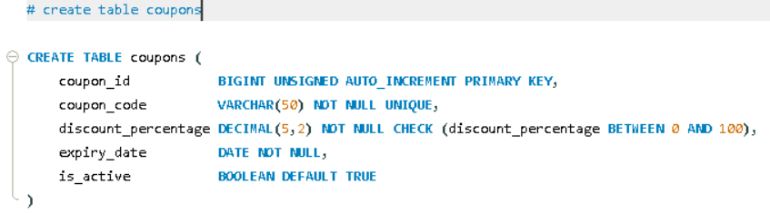

English Explanation


```markdown
Let's understand the final table, `coupons` — this is the simplest table in the schema because it doesn't contain any foreign keys (a standalone table).

```sql
CREATE TABLE coupons (

```

A new table named **`coupons`** — this stores the discount codes that customers can apply at checkout (e.g., "WELCOME10" → 10% off).

---

```sql
coupon_id BIGINT UNSIGNED AUTO_INCREMENT PRIMARY KEY,

```

* The unique, auto-generated internal ID for each coupon.

---

```sql
coupon_code VARCHAR(50) NOT NULL UNIQUE,

```

* **`coupon_code`** — The actual text that the customer types in (e.g., "WELCOME10", "FESTIVE20").
* **`NOT NULL`** — Providing a code is mandatory; a coupon record makes no sense without the actual text code.
* **`UNIQUE`** — No two coupons can share the exact same code, because the system must be able to identify one specific offer per code. Here, both `coupon_id` (internal-facing) and `coupon_code` (business/customer-facing) are unique — similar to how `product_id` and `sku` work together in the `products` table.

---

```sql
discount_percentage DECIMAL(5,2) NOT NULL CHECK (discount_percentage BETWEEN 0 AND 100),

```

* **`DECIMAL(5,2)`** — As seen with prices, `DECIMAL` is the best data type for money or percentages because it eliminates floating-point rounding errors. The `(5,2)` designation means a total of 5 digits are allowed, with 2 digits after the decimal point — capping out perfectly for values up to 100.00 (e.g., 12.50 or 100.00).
* **`CHECK (discount_percentage BETWEEN 0 AND 100)`** — Just like the rating constraint in the `reviews` table, this provides database-level range validation: the discount must always be between 0% and 100%. Attempting to insert a 150% or a -10% discount will be rejected outright. Logically, a 150% discount would mean the company is paying the customer to take the product!

---

```sql
expiry_date DATE NOT NULL,

```

* **`DATE` type** — Similar to `shipments.estimated_delivery`, we only care about the calendar date, not the exact time (e.g., "This coupon expires on December 31st" — hours and minutes do not matter).
* **`NOT NULL`** — Every coupon is required to have an expiration date. According to this database design, no coupon can remain valid indefinitely. This represents an excellent business practice: all promotional offers must have a defined lifecycle.

---

```sql
is_active BOOLEAN DEFAULT TRUE,

```

* **`BOOLEAN`** — Stores a TRUE/FALSE value, just like `addresses.is_default`.
* **`DEFAULT TRUE`** — When a new coupon is created, it is active by default and instantly ready for customer use.

**Why do we need `is_active` if we already have `expiry_date`?**

* **`expiry_date`** provides **automatic/time-based control** (the coupon naturally expires on its own once the date passes).
* **`is_active`** provides **manual/administrative control**. This allows an admin to instantly deactivate a coupon *before* its official expiration date (e.g., if a coupon accidentally gives too much discount due to a typo, or if the business decides to end a promotion early).
* **Combined Validity:** Together, they offer ultimate flexibility. A coupon is only considered valid if both conditions are met: `is_active = TRUE AND expiry_date >= today`. The application's validation query will look something like this: `WHERE is_active = TRUE AND expiry_date >= CURDATE()`.


---

### 💡 How This Table Differs From the Rest

It contains **no foreign keys**, meaning `coupons` is a completely standalone/independent table in this schema design. If desired in the future, it could easily be linked to the `orders` table (e.g., adding a `coupon_id` column to `orders` to track which coupon was used to get a discount). In the current design, coupons act as a reference list validated entirely at the application logic level.

---

**Summary in one line:**
The `coupons` table stores promotional discount codes, ensuring the percentage stays within bounds using a `CHECK BETWEEN` constraint, while utilizing `expiry_date` for automatic scheduling and `is_active` for manual administrative overrides to determine a coupon's true validity.

---

## 🎉 Complete Database Schema Architecture Summary

Here is a bird's-eye view of all 12 tables and the advanced database architectural choices implemented across your schema:

| # | Table | Core & Special Database Concepts Implemented |
| --- | --- | --- |
| **1** | **`users`** | Core system entity, `AUTO_INCREMENT`, `UNIQUE` constraints on user data. |
| **2** | **`addresses`** | `ON DELETE CASCADE` behavioral logic, 1-to-Many strict relationship topology. |
| **3** | **`categories`** | Self-referencing Foreign Key hierarchy, safe `ON DELETE SET NULL` structural handling. |
| **4** | **`products`** | Exact numerical `DECIMAL` scale for prices, data integrity `CHECK` constraints, `RESTRICT` deletions. |
| **5** | **`inventory`** | Real-time automated temporal tracking via `ON UPDATE CURRENT_TIMESTAMP`, negative stock defense. |
| **6** | **`cart_items`** | Junction table modeling Many-to-Many relationships, strict multi-column **Composite UNIQUE KEY**. |
| **7** | **`orders`** | Finite state handling using **`ENUM` status values**, transactional `RESTRICT` flags to legally protect financial data history. |
| **8** | **`order_items`** | **Price Snapshot pattern** via `price_per_unit` to cleanly separate historical data from live store pricing. |
| **9** | **`payments`** | **`TIMESTAMP NULL` syntax** to accurately mirror business event timelines over database insertion events. |
| **10** | **`shipments`** | `DATE` data type (ignoring hours/minutes for real-world practicality), dual-level granular tracking workflow. |
| **11** | **`reviews`** | Storage-optimized **`TINYINT`**, boundary-based validation via `CHECK BETWEEN`, anti-spam composite keys. |
| **12** | **`coupons`** | Standalone master reference table featuring distinct dual-layer validity control mechanics. |


```

```

Hinglish Explanation

Chaliye is aakhri table `coupons` ko samjhte hain — yeh schema ka sabse simple table hai, kyunki isme **koi foreign key nahi hai** (standalone table).

```sql
CREATE TABLE coupons (
```
Naya table **`coupons`** — discount codes store karta hai jo checkout ke time apply kiye ja sakte hain (jaise "WELCOME10" → 10% off).

---

```sql
coupon_id BIGINT UNSIGNED AUTO_INCREMENT PRIMARY KEY,
```
- Har coupon ka apna unique, auto-generated internal ID.

---

```sql
coupon_code VARCHAR(50) NOT NULL UNIQUE,
```
- **`coupon_code`** — wo actual text jo customer type karta hai (jaise `"WELCOME10"`, `"FESTIVE20"`).
- **`NOT NULL`** — code dena zaroori hai, bina code ke coupon ka koi matlab nahi.
- **`UNIQUE`** — do coupons ka code same nahi ho sakta, kyunki system ko har code se ek hi specific offer identify karni hoti hai. Yahan `coupon_id` aur `coupon_code` dono unique hain — waisa hi jaisa `products` table me `product_id` (internal) aur `sku` (business-facing) dono unique the.

---

```sql
discount_percentage DECIMAL(5,2) NOT NULL CHECK (discount_percentage BETWEEN 0 AND 100),
```
- **`DECIMAL(5,2)`** — jaise `price` me dekha tha, money/percentage ke liye `DECIMAL` best hai (rounding errors nahi hote). Yahan `(5,2)` ka matlab: total 5 digits allowed, 2 decimal ke baad — jaise `100.00` ya `12.50` tak (chhoti range hai kyunki percentage kabhi 100 se zyada nahi hoga).
- **`CHECK (discount_percentage BETWEEN 0 AND 100)`** — jaisa `reviews.rating` me `BETWEEN 1 AND 5` tha, yahan bhi range validation hai: discount hamesha **0% se 100% ke beech** hona chahiye. Koi `150%` ya `-10%` discount insert nahi ho sakta — logically bhi impossible hoga (150% discount ka matlab hoga company customer ko paisa de rahi hai!).

---

```sql
expiry_date DATE NOT NULL,
```
- **`DATE`** type — jaise `shipments.estimated_delivery` me tha, sirf date chahiye, exact time nahi (coupon "31 December ko expire hoga" — ghanta-minute matter nahi karta).
- **`NOT NULL`** — har coupon ki expiry date honi zaroori hai, koi bhi coupon **permanently valid** nahi ho sakta database design ke hisaab se — yeh ek good business practice hai, sab offers ki ek limit honi chahiye.

---

```sql
is_active BOOLEAN DEFAULT TRUE,
```
- **`BOOLEAN`** — jaise `addresses.is_default` me dekha tha, TRUE/FALSE value.
- **`DEFAULT TRUE`** — jab naya coupon banaya jaata hai, by-default active hota hai (turant use karne ke liye ready).
- **Yeh column `expiry_date` se alag aur zaroori kyun hai?** — Sochne wali baat: agar `expiry_date` already hai, to `is_active` ki zaroorat kya hai? 
  - **`expiry_date`** — automatic/time-based control hai (coupon apne aap expire ho jaata hai date ke baad).
  - **`is_active`** — manual/admin control hai. Isse admin **kabhi bhi**, expiry date se pehle bhi, coupon ko turant band kar sakta hai (jaise agar koi coupon galti se bahut zyada discount de raha hai, ya offer jaldi khatam karni ho business reason se).
  - Dono milke flexible control dete hain: coupon tabhi valid hoga jab **dono conditions true hon** — `is_active = TRUE` **AND** `expiry_date >= today`. Application query kuch aisi hogi: `WHERE is_active = TRUE AND expiry_date >= CURDATE()`.


---

**Yeh table baaki sab tables se kaise alag hai:**
- Iska **koi foreign key nahi hai** — matlab `coupons` kisi doosre table se directly linked nahi hai is schema me. Yeh ek **standalone/independent table** hai.
- Agar aap chahen to future me isse `orders` table se link kar sakte hain (jaise `orders` me ek `coupon_id` column add karke, taaki pata chale kaunsa order kis coupon se discount le raha tha) — abhi ke design me yeh connection nahi hai, coupons sirf ek reference list hai jo application-level par validate hoti hai.

---

**Summary ek line me:** `coupons` table discount codes store karta hai, `discount_percentage` `CHECK (BETWEEN 0 AND 100)` se valid range me rehta hai, `expiry_date` automatic time-based expiry deta hai jabki `is_active` admin ko manual on/off control deta hai — dono milkar coupon ki validity decide karte hain.

---

**🎉 Poori schema ka complete summary — sab 12 tables cover ho gaye:**

| # | Table | Special Concept |
|---|---|---|
| 1 | `users` | Base entity, `AUTO_INCREMENT`, `UNIQUE email` |
| 2 | `addresses` | `CASCADE` delete, 1-to-many with users |
| 3 | `categories` | Self-referencing FK, `SET NULL` delete |
| 4 | `products` | `DECIMAL` for price, `CHECK`, `RESTRICT` delete |
| 5 | `inventory` | `ON UPDATE CURRENT_TIMESTAMP`, `CHECK >= 0` |
| 6 | `cart_items` | Composite `UNIQUE KEY`, junction table |
| 7 | `orders` | `ENUM` status, `RESTRICT` for history preservation |
| 8 | `order_items` | Price "snapshot" concept (`price_per_unit`) |
| 9 | `payments` | `TIMESTAMP NULL` (business-event timing) |
| 10 | `shipments` | `DATE` type, granular `ENUM` status |
| 11 | `reviews` | `TINYINT`, `CHECK BETWEEN`, composite unique |
| 12 | `coupons` | Standalone table, dual validity control |

Agar chahiye, main is poore explanation ko ek **README ke andar ek naya section** bana ke bhi de sakta hoon (jaise "Schema Design Decisions" section), taaki GitHub par jo bhi aapka project dekhega, use yeh saari design choices samajh aayein — recruiters ke liye yeh bahut impressive lagta hai jab schema ke peeche ka **"why"** bhi document kiya gaya ho, sirf "what" nahi.