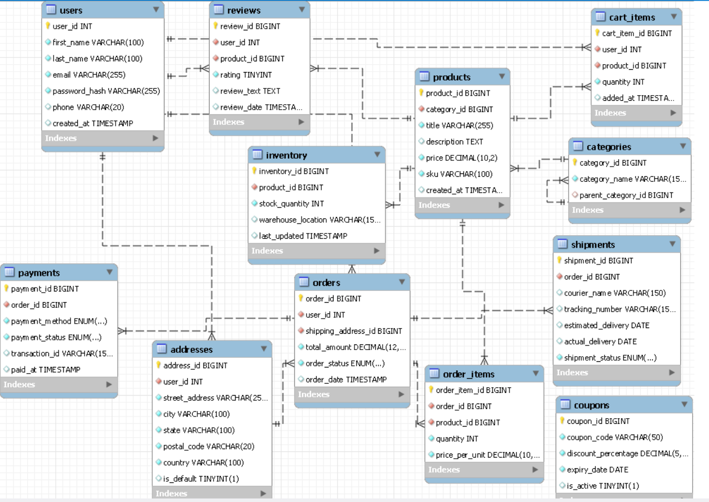

English

### 🗄️ Database Architecture & Schema Explanation

This E-commerce database schema is designed for scalability, data integrity, and real-world business logic. The architecture is divided into five core modules:

*   **User Management (`users`, `addresses`):** Handles user profiles and authentication. A strict one-to-many relationship is established, allowing a single user to maintain multiple delivery addresses seamlessly.
*   **Product Catalog (`categories`, `products`, `inventory`):** Manages the entire product hierarchy. The `categories` table supports self-referencing for parent-child subcategories. The `inventory` table is intentionally separated from `products` to ensure accurate, real-time stock tracking.
*   **Order Processing (`cart_items`, `orders`, `order_items`):** Manages the end-to-end shopping flow. The `order_items` table acts as a crucial junction bridge, capturing the exact price and quantity at the time of purchase to preserve historical financial data even if product prices change in the future.
*   **Fulfillment & Transactions (`payments`, `shipments`):** Tracks order lifecycles post-checkout. It securely logs financial transaction statuses and monitors physical courier tracking steps (Processing, Shipped, Delivered).
*   **Engagement & Promotions (`reviews`, `coupons`):** Users can leave product reviews (database constraints ensure only one review per user per product). A standalone `coupons` table manages platform-wide percentage discounts with expiry validations.

Hindi

Is EER Diagram ka Explanation
Yeh diagram ek complete E-commerce system ke architecture ko darshata hai. Ise hum 5 main hisson (modules) mein easily samajh sakte hain:

User Module (users, addresses): Sabse pehle user platform par register karta hai (users). Ek user ke multiple addresses (ghar, office) ho sakte hain, isliye addresses table ko user se 1-to-Many relationship (ek se zyada) mein joda gaya hai.

Catalog Module (categories, products, inventory): Har product kisi na kisi category ka hissa hota hai. categories table mein self-reference ka option hai (jaise Parent Category -> Sub Category). Product ka stock track karne ke liye alag se inventory table hai, jo real-time stock update rakhne ke liye best practice hai.

Shopping Flow (cart_items, orders, order_items): Jab user kuch pasand karta hai toh woh cart_items mein jaata hai. Checkout ke waqt ek main orders ka record banta hai. Kyunki ek order mein multiple items (products) ho sakte hain, isliye order_items table banayi gayi hai jo Order aur Product ke beech ek bridge ka kaam karti hai.

Fulfillment Module (payments, shipments): Order place hone ke baad, uski financial transaction track karne ke liye payments table hai, aur physical delivery/courier status track karne ke liye shipments table banayi gayi hai. Yeh dono direct orders table se connected hain.

Extras (reviews, coupons): User product kharidne ke baad reviews de sakta hai (yeh User aur Product dono se linked hai). coupons table standalone banayi gayi hai, jiska use system order total par discount lagane ke liye karega.